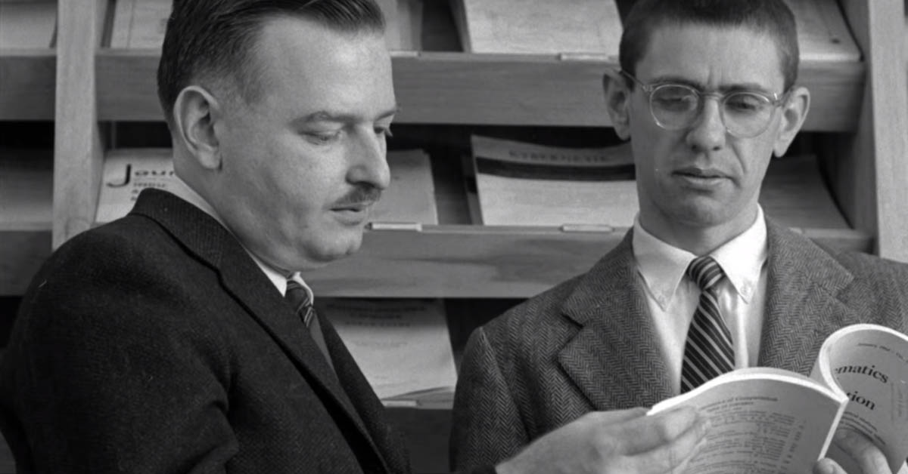

<<<<<<< HEAD
# __1964 BASIC Computer Language__
### __John Kemeny__ (1926–1992), __Thomas Kurtz__ (b. 1928)
___
Profesor Dartmouth John Kemeny dan Thomas Kurtz menciptakan Kode Instruksi Simbolik Serba Guna (BASIC) Pemula sehingga siswa biasa bukan kutu buku komputer dapat mempelajari cara memprogram dan menggunakan komputer untuk memecahkan masalah yang menantang.

Tidak seperti bahasa pemrograman lain pada saat itu, BASIC Dartmouth menggunakan perintah yang sederhana dan mudah dipahami. Misalnya, perintah yang diketik di teleprinter akan segera dieksekusi. Jadi mengetik PRINT 2+2 akan mencetak 4. Untuk membuat program, siswa cukup mengawali setiap baris dengan nomor baris. Jadi mengetik 10 PRINT 2+2 akan membuat program yang, ketika dijalankan (dengan mengetik RUN, tidak kurang), akan menyebabkan angka 4 tercetak ketika komputer mencapai baris 10. BASIC dirancang sedemikian sederhana sehingga siswa akan menemukannya program terbukti dengan sendirinya hanya dengan membacanya.

Pada tahun 1968, BASIC telah digunakan di lebih dari 80 kursus di Dartmouth —termasuk kursus yang beragam seperti bahasa Latin, statistik, dan psikologi. Dan itu telah menyebar ke empat perguruan tinggi lain dan 23 sekolah menengah, dengan total lebih dari 8.000 pengguna.

BASIC segera lolos dari Dartmouth. Versi ditulis untuk komputer yang diproduksi oleh Digital, Data General®, dan Hewlett-Packard (HP®). Pada tahun 1973, David Ahl (b. 1939), seorang insinyur di Digital, meyakinkan perusahaannya untuk menerbitkan sebuah buku berjudul 101 BASIC Computer Games. Pada tahun 1976, Jurnal Dr. Dobb menerbitkan daftar Tiny BASIC, versi BASIC yang dapat berjalan di komputer dengan RAM kurang dari 3 kilobyte—ideal untuk komputer Altair 8800. Program Tiny BASIC gratis segera diikuti oleh Altair BASIC, program komersial yang ditulis oleh Bill Gates dan Paul Allen. Altair BASIC dijual dengan harga $150. Harga yang mahal mendorong banyak penghobi untuk mendapatkan dan menjalankan salinan yang tidak sah, secara tidak sengaja menciptakan kasus pembajakan perangkat lunak pertama yang tersebar luas.

Selama dekade berikutnya, hampir setiap komputer mikro yang dijual di planet ini dilengkapi dengan beberapa versi BASIC yang terpasang di memori hanya-baca (ROM). (ROM seperti RAM, kecuali isinya tidak dapat diubah; ini sering digunakan untuk perangkat lunak yang didistribusikan oleh produsen komputer.) Bagi jutaan orang, itu adalah bahasa pemrograman pertama mereka. Hari ini, Visual Basic for Applications dibangun ke dalam Microsoft Access, Excel, Word, Outlook, dan PowerPoint.

*Tom Kurtz dan John Kemeny memeriksa brosur untuk komputer mainframe GE-225 yang mendukung versi awal sistem pembagian waktu Dartmouth*
