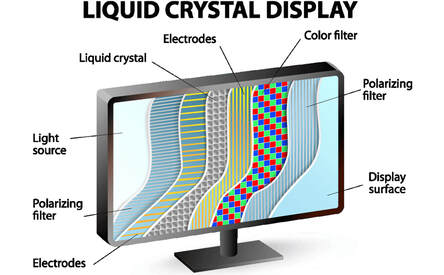
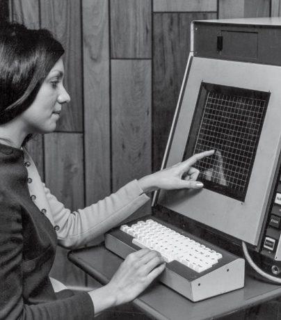
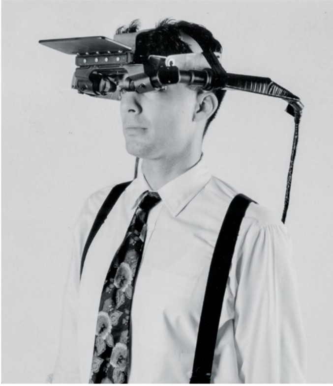
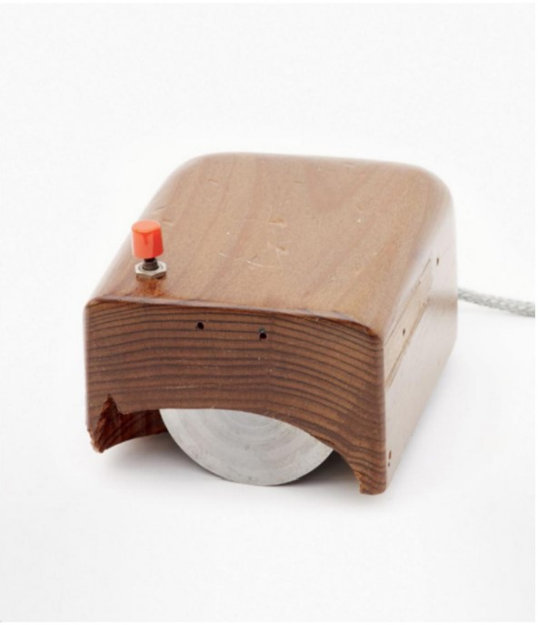
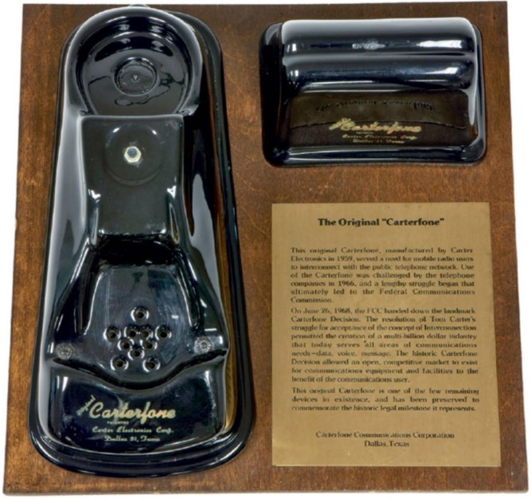
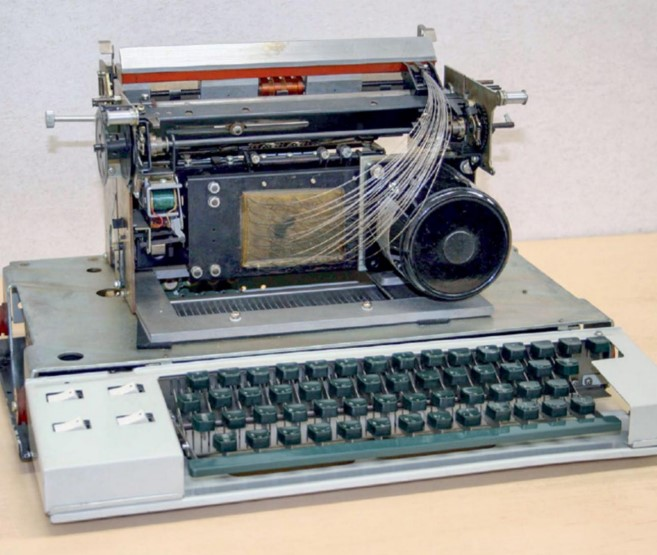

# ___Komputer Dan Masyarakat___
## __1964 IBM System/360 s.d 1967 First Cash Machine__
### Oleh : Muhammad Nasrudin dan Muhammad Supiani Hasan
___
### __1964 IBM System/360__
#### __Gene Amdahl__ (1922 – 2015), __Fred Brooks__ (b. 1931)
___

__International Business Machines (IBM) System/360 ( S/360 )__ adalah keluarga sistem komputer mainframe yang diumumkan oleh IBM pada tanggal 7 April 1964, dan dikirimkan antara tahun 1965 dan 1978. Itu adalah keluarga komputer pertama yang dirancang untuk mencakup rangkaian lengkap aplikasi , dari kecil hingga besar, baik komersial maupun ilmiah. Desain membuat perbedaan yang jelas antara arsitektur dan implementasi, memungkinkan IBM untuk merilis serangkaian desain yang kompatibel dengan harga yang berbeda. Semua kecuali sistem yang paling mahal menggunakan mikrokode untuk mengimplementasikan set instruksi, yang menampilkan pengalamatan byte 8-bit dan perhitungan biner, desimal dan floating-point.

### __1964 BASIC Computer Language__
#### __John Kemeny__ (1926–1992), __Thomas Kurtz__ (b. 1928)
___
Profesor Dartmouth John Kemeny dan Thomas Kurtz menciptakan Kode Instruksi Simbolik Serba Guna (BASIC) Pemula sehingga siswa biasa bukan kutu buku komputer dapat mempelajari cara memprogram dan menggunakan komputer untuk memecahkan masalah yang menantang.

Tidak seperti bahasa pemrograman lain pada saat itu, BASIC Dartmouth menggunakan perintah yang sederhana dan mudah dipahami. Misalnya, perintah yang diketik di teleprinter akan segera dieksekusi. Jadi mengetik PRINT 2+2 akan mencetak 4. Untuk membuat program, siswa cukup mengawali setiap baris dengan nomor baris. Jadi mengetik 10 PRINT 2+2 akan membuat program yang, ketika dijalankan (dengan mengetik RUN, tidak kurang), akan menyebabkan angka 4 tercetak ketika komputer mencapai baris 10. BASIC dirancang sedemikian sederhana sehingga siswa akan menemukannya program terbukti dengan sendirinya hanya dengan membacanya.

### __1965 First Liquid-Crystal Display__
#### __George Heilmeier__ (1936–2014)
____

Keadaan materi kristal cair ditemukan di Karl-FerdinandsUniversität di Praha pada tahun 1888 oleh Friedrich Reinitzer dan diselidiki lebih lanjut pada tahun 1900-an dan 1930-an. Tetapi sebaliknya, kemampuan aneh dari beberapa cairan untuk memiliki sifat kristal khususnya kemampuan untuk mengubah polarisasi cahaya—tetap menjadi keingintahuan kimia, dan bukan subjek eksplorasi atau eksploitasi praktis.

Kemudian, pada awal 1960-an, para insinyur di Laboratorium David Sarnoff RCA di Princeton, New Jersey, mencari jenis layar baru yang dapat menggantikan tabung vakum yang digunakan pada TV berwarna. Ahli kimia fisik RCA® Richard Williams mengalihkan perhatiannya ke kristal cair dan menemukan bahwa bahan kimia tertentu, yang dipanaskan hingga 243° Fahrenheit (117° Celcius), akan mengubah penampilannya dari transparan menjadi buram saat ditempatkan di medan listrik bertegangan tinggi.

Kelompok Heilmeier membangun layar kristal cair pertama pada tahun 1965, menggunakan sedikit kristal cair yang diapit di antara polarizer dan permukaan reflektif, yang secara terpisah mengendalikan tujuh segmen layar satu digit; selanjutnya, kelompok tersebut membuat LCD yang menampilkan pola uji TV kecil.

### __1965 Fiber Optics__
#### __Narinder Singh Kapany__ (b. 1926), __Jun-ichi Nishizawa__ (b. 1926), __Manfred Börner (1929–1996)__, __Robert Maurer (b. 1924), Donald Keck__ (b. 1941), __Peter Schultz__ (b. 1942), __Frank Zimar__ (dates unavailable)
___

Transmisi serat optik mengambil informasi dalam bentuk 1s dan 0, mengkodekannya sebagai pulsa cahaya, dan menembakkannya melalui pipa kaca silinder kecil yang tidak lebih lebar dari rambut manusia. Setelah bergerak melalui kaca dengan kecepatan cahaya, pulsa diubah kembali ke bentuk elektronik aslinya. Untuk data komputer, itu akan menjadi 1s dan 0s. Suara harus melalui langkah tambahan yaitu didigitalkan ke 1 dan 0 sebelum dikirim, dan direkonstruksi menjadi gelombang analog di sisi penerima.

Gagasan membengkokkan atau mengendalikan cahaya dan menggunakannya untuk memecahkan masalah sehari-hari, termasuk transmisi informasi yang lebih cepat, bukanlah hal baru. Contoh awal komunikasi optik termasuk heliograf dari tahun 1800-an, yang menggunakan cermin untuk menghasilkan kilatan sinar matahari yang dikodekan untuk huruf atau angka. Kemudian di abad itu, Alexander Graham Bell (1847–1922) dan asistennya Thomas Augustus Watson (1854–1934) menemukan photophone, yang menggunakan berkas cahaya termodulasi terhadap penerima selenium untuk membawa kata-kata yang diucapkan.

### __1965 DENDRAL__
#### __Joshua Lederberg__ (1925–2008), __Bruce G. Buchanan__ (dates unavailable), __Edward Feigenbaum__ (b. 1936), __Carl Djerassi__ (1923–2015)
___

DENDRAL adalah proyek penelitian komputer berpengaruh awal dalam pengembangan sistem AI modern. Ini membantu mengalihkan fokus penelitian AI dari mengembangkan kecerdasan umum ke menciptakan sistem yang disesuaikan untuk area tertentu. Itu dilakukan dengan mewakili pengetahuan para ahli kimia dengan cara yang dapat digunakan oleh komputer, memungkinkan sistem kode dan data untuk memecahkan masalah kimia yang didefinisikan secara sempit dan menarik kesimpulan dengan cara yang sama seperti yang mungkin dilakukan oleh seorang ahli manusia, sehingga menghasilkannya beri nama "sistem pakar".

DENDRAL dimulai pada tahun 1965, ketika ahli genetika Joshua Lederberg sedang mencari platform penelitian berbasis komputer untuk memajukan pemahamannya tentang senyawa organik untuk mendukung penelitian eksobiologinya cabang astrobiologi yang berupaya memahami evolusi kehidupan di planet lain. Lederberg meminta kemitraan asisten profesor Stanford Edward Feigenbaum, salah satu pendiri departemen ilmu komputer sekolah, ahli kimia Stanford Carl Djerassi, dan programmer AI virtuoso Bruce Buchanan untuk mengembangkan sistem yang dapat menyarankan struktur kimia dan spektrum massa yang mungkin terdiri dari mereka. Proyek ini berlangsung selama kurang lebih 15 tahun, mengembangkan program yang dirancang untuk memodelkan penalaran ilmiah dan menjelaskan kimia eksperimental ke dalam sistem yang dapat digunakan ahli kimia untuk menghasilkan hipotesis dan, pada akhirnya, untuk mempelajari hal-hal baru tentang kimia.

### __1965 ELIZA__
#### __Joseph Weizenbaum__ (1923–2008)
___

ELIZA, dinamai sesuai karakter Eliza Doolittle dalam drama Pygmalion karya George Bernard Shaw, adalah program pertama yang dapat berkomunikasi dalam bahasa Inggris. Dibutuhkan sebaris teks yang diketik manusia pada teleprinter, mengubah teks—misalnya, mengubah Anda menjadi saya dan saya menjadi Anda—dan kemudian mengirim kembali teks tersebut ke juru ketik manusia. Sama seperti burung beo, komputer tidak tahu apa yang dikatakannya.

Profesor MIT Joseph Weizenbaum memodelkan "program analisis bahasa" pada psikoterapi Rogerian, sejenis terapi nondirektif yang tidak melibatkan interpretasi pernyataan klien. Mengikuti teknik ini, ELIZA mengubah "Saya tidak bahagia" menjadi "APAKAH ANDA BERPIKIR DATANG KE SINI AKAN MEMBANTU ANDA TIDAK BAHAGIA?" Sebagian besar transformasi ini dipicu oleh kata kunci sederhana; ketika program terhenti, itu menampilkan pertanyaan yang telah diprogram.

### __1965 Touchscreen__
#### __E. A. Johnson__ (dates unavailable), __Dr. Sam Hurst__ (1927–2010), __Nimish Mehta__ (dates unavailable)
___

Pada tahun 1955, proyek MIT Whirlwind menciptakan pena ringan yang memungkinkan pengguna menunjukkan titik di layar komputer. Tapi bisa menunjuk lebih alami dengan jari Anda sendiri? Itulah penemuan E. A. Johnson di Royal Radar Establishment (RRE).

Johnson adalah seorang peneliti yang bekerja pada sistem kontrol lalu lintas udara RRE. Pada tahun 1965, ia menerbitkan sebuah artikel di Electronic Letters berjudul “Touch Display—A Novel Input/Output Device for Computers” yang menggambarkan layar yang peka terhadap sentuhan. Dua tahun kemudian, ia memperluas gagasannya dalam sebuah artikel di Ergonomics, menunjukkan bagaimana layar sentuh dapat digunakan untuk berinteraksi dengan grafik dan gambar.

Johnson menemukan apa yang sekarang disebut layar sentuh kapasitif. Ini menggunakan lapisan di layar untuk menyimpan muatan listrik. Saat pengguna menyentuh layar, sebagian muatan ditransfer ke pengguna. Ini mengirimkan sinyal ke sistem operasi perangkat tempat sentuhan terjadi di layar.

Layar sentuh awal hanya dapat merasakan satu sentuhan pada satu waktu. Nimish Mehta mengembangkan perangkat multitouch pertama di University of Toronto pada tahun 1982. Teknologi terus berkembang seiring dengan potensi aplikasi komersial, akhirnya mencapai massa di tahun 2000-an. Selama periode ini, itu menjadi alat yang populer untuk kolaborasi desain.

*Layar sentuh mulai digunakan dengan banyak aplikasi. Digambarkan di sini adalah operator yang menggunakan layar sentuh pada sistem pendidikan berbasis komputer bersama PLATO (Programmed Logic Automated Teaching Operation).*

### __1966 Star Trek Premieres__
#### __Gene Roddenberry__ (1921–1991), __William Shatner__ (b. 1931), __Leonard Nimoy__ (1931–2015), __Nichelle Nichols__ (b. 1932)
___

Pada tanggal 8 September 1966, National Broadcasting Company (NBC®) menayangkan perdana Star Trek, sebuah acara televisi fiksi ilmiah baru oleh Gene Roddenberry. Acara ini berlangsung dari tahun 1966 hingga 1969 dan akan tumbuh menjadi waralaba fiksi ilmiah paling berpengaruh dalam sejarah, yang pada akhirnya menghasilkan 7 acara TV yang berbeda, 13 film, dan lebih banyak kontribusi untuk budaya populer  “Beam me up, Scotty!” daripada yang bisa diukur secara akurat. Pada saat perang dan ketakutan akan teknologi yang tidak terkendali menjadi ketakutan sehari-hari, Star Trek memamerkan visi masa depan alternatif di mana umat manusia telah berevolusi dan mengatasi kemiskinan dan kebutuhan material, memanfaatkan teknologi untuk mengatasi berbagai tantangan.

Komputer dan robot memainkan peran penting dalam banyak episode Star Trek. Enterprise dilengkapi dengan komputer kapal yang memelihara penyimpanan informasi besar-besaran, menawarkan aksesibilitas universal di seluruh kapal, dan merespons perintah manusia dengan suara. Sementara itu, kru menghadapi masyarakat yang membuat perang dengan komputer dan peradaban yang diperintah oleh komputer, serta robot yang melahap planet, mengirim orang kembali melalui waktu, atau bermanifestasi dalam bentuk humanoid.

### __1966 Dynamic RAM__
#### __Robert H. Dennard__ (b. 1932)
___

Sejak awal, ingatan kecil membatasi apa yang dapat dilakukan komputer. Disebut random access memory (RAM) karena lokasi mana pun dapat dibaca atau ditulis kapan saja, memori itu sangat mahal. Dan karena pemrogram sering kali tidak memiliki cukup memori untuk bekerja, mereka harus membagi program dan data mereka menjadi beberapa segmen, menyalin satu segmen ke dalam memori, memprosesnya, dan kemudian menyimpan hasilnya pada pita.

IBM berkomitmen untuk menyelesaikan desain yang menggunakan enam transistor—desain yang sekarang disebut static random access memory (SRAM)—jadi Dennard mengejar DRAM sebagai proyek sampingan. Akhirnya, pada tahun 1967, IBM mengajukan paten untuk DRAM, yang diberikan pada tahun 1968.

### __1967 Object-Oriented Programming__
#### __Ole-Johan Dahl__ (1931–2002), __Kristen Nygaard__ (1926–2002)
___

Di Pusat Komputasi Norwegia, profesor Ole-Johan Dahl dan Kristen Nygaard ingin menggunakan komputer mereka untuk mensimulasikan sistem fisik, khususnya simulasi kapal, dan di sini mereka menemukan bahasa pemrograman yang dikembangkan untuk memungkinkan tugas sederhana dan berulang menjadi kurang. Jadi mereka mengembangkan cara baru untuk memprogram dan bahasa komputer baru, yang mereka sebut SIMULA 67.

Ide kunci dari SIMULA adalah untuk data yang mewakili objek fisik untuk digabungkan bersama dengan kode komputer untuk bertindak pada data tersebut. Misalnya, simulasi lalu lintas mungkin memiliki tipe data yang disebut CAR yang mungkin memiliki variabel untuk lokasi dan kecepatan mobil. Sebuah fungsi khusus mungkin menangani perilaku mobil ketika bertemu lampu lalu lintas. SIMULA mengacu pada masing-masing tipe data ini sebagai "kelas." Kelas berbeda yang disebut TRUCK mungkin mewakili truk. Ide kunci lainnya adalah pewarisan, yang memungkinkan kelas dengan karakteristik bersama untuk diatur dalam hierarki. Jadi TRUCK dan CAR mungkin mewarisi dari kelas abstrak yang disebut KENDARAAN, yang dengan sendirinya mungkin mewarisi dari kelas abstrak lain yang disebut OBJEK.

### __1967 First Cash Machine__
#### __James Goodfellow__ (b. 1937), __John Shepherd-Barron__ (1925–2010), __Donald Wetzel__ (b. 1921), __Luther George Simjian__ (1905–1997)
___

Tidak ada satu pun penemu mesin anjungan tunai mandiri (ATM), meskipun sudah banyak orang yang mencoba mengklaimnya. Sebaliknya, itu adalah hasil dari serangkaian inovasi oleh banyak orang selama bertahun-tahun, yang mengarah pada peluncuran penting tahun 1967 dari dua mesin yang bersaing tetapi berbeda di Inggris yang diperkenalkan dalam waktu satu bulan satu sama lain.

Mesin James Goodfellow, yang diperkenalkan oleh Westminster Bank di London, menggunakan kartu plastik dan nomor identifikasi pribadi (PIN) untuk verifikasi dan akses pelanggan. Mesin John Shepherd-Barron, yang diperkenalkan oleh Barclays, menggunakan pemeriksaan radioaktif ringan yang diresapi dengan karbon-14 yang diandalkan ATM untuk dicocokkan dengan nomor identifikasi pelanggan. Sementara mesin Shepherd-Barron mengalahkan Goodfellow ke pasar sebulan (dan dengan demikian menerima banyak kemuliaan "pertama"), itu adalah desain PIN Goodfellow yang macet dan akhirnya melihat komersialisasi dan lisensi massal oleh produsen. Dia juga memiliki paten pertama untuk ATM yang menggunakan PIN untuk otentikasi.

### __1967 Head-Mounted Display__
#### __Ivan E. Sutherland__ (b.1938)
___
Head-Mounted Display (HMD) adalah tampilan  video imersif awal dan yang pertama menggunakan komputer alih-alih kamera untuk mensimulasikan ruang fisik. Ini terdiri dari enam bagian: komputer serba guna, pengganda matriks, generator vektor, elektronik khusus yang disebut pembagi kliping yang menghilangkan garis-garis yang tersembunyi di belakang pengamat atau di luar bidang pandang, headset, dan sensor posisi kepala. 

Ada layar di depan mata yang menyajikan gambar yang sedikit berbeda untuk setiap mata, yang menghasilkan rasa kedalaman. Sensor memberi tahu komputer saat Anda menggerakkan kepala, dan komputer memperbarui layar sesuai dengan itu.

*Layar yang dipasang di kepala Ivan Sutherland memungkinkan seseorang untuk mengubah arah pandangan mereka dan bahkan bergerak di sekitar ruangan; ketika orang tersebut bergerak, setiap tampilan mata diperbarui sesuai.*

### __1967 Programming for Children__
#### __Seymour Papert__ (1928-2016) __,Wally Feurzeig__ (1927-2013) __, Cyntia Solomon__ (dates unavailable)
___
Seymour Papert, Wally Feurzeig, dan Cynthia Solomon berpikir bahwa pemrograman bisa menjadi alat yang ampuh untuk mengajar anak-anak tentang berpikir, merencanakan, dan berpikir abstrak. Jadi saat bekerja di perusahaan riset Bolt, Beranek, dan Newman (sekarang BBN Technologies®) di Cambridge, Massachusetts, mereka merancang bahasa komputer untuk anak-anak, dengan beberapa perintah yang dapat digabungkan untuk memungkinkan tugas-tugas kompleks. Pemrograman dalam bahasa ini, yang disebut **Logo**, memungkinkan anak-anak membuat instruksi untuk komputer sedemikian rupa sehingga mereka dapat merangkai banyak kata sederhana untuk menyampaikan pemikiran yang rumit. Beberapa program awal yang ditulis anak-anak adalah kuis matematika dan chatbot.

Meskipun program dalam versi awal Logo tidak lebih dari berkomunikasi dengan pengguna melalui teks, penemu segera memungkinkan mesin untuk mengontrol robot mekanik yang disebut **turtle**, yang dapat diinstruksikan oleh program untuk bergerak maju, mundur, atau belok. Penyu asli adalah robot bernama Irving; itu merangkak di selembar kertas sebagai tanggapan atas perintah dari mesin di dekatnya. Irving memiliki pena yang bisa dijatuhkan dan diseret untuk membuat gambar. Akhirnya, Irving menjadi kura-kura virtual di layar komputer, memungkinkan untuk berbagi Logo dengan lebih banyak orang.

### __1967 The Mouse__
#### __Douglas C. Engelbart__ (1925-2013) __,Bill English__ (dates unavailable) 
___

Asal-usul awal mouse dapat dilihat di bola roller Ralph Benjamin, diakui sebagai asal trackball modern. Tidak seperti trackball, yang tidak bergerak dan mengharuskan pengguna untuk menggerakkan tangan dan jari di atasnya, mouse mengharuskan seluruh perangkat diposisikan ulang.

Mouse Engelbart terdiri dari kotak kayu dengan tiga tombol di atas dan dua roda di bawah yang diposisikan pada sudut kanan untuk mengontrol gerakan horizontal dan vertikal. Saat roda berputar, jarak dan lokasi ditangkap sebagai kode biner di komputer, yang diterjemahkan ke dalam output visual di layar. Engelbart menemukan mouse untuk mengontrol navigasi pada sistem kolaborasi komputer inovatif yang ia rancang yang disebut **oN-Line System (NLS).**

*Replika prototipe mouse Engelbart, dibuat oleh insinyur Bill English, 1964*

### __1968 Carterfone Decision__
#### __Thomas Carter__ (1924-1991)
___

Thomas Carter, pengusaha Texas dan penemu yang menciptakan Carterfone, perangkat yang menghubungkan radio dua arah ke jaringan telepon, memungkinkan mereka yang berada di tempat yang jauh untuk tetap berhubungan dengan orang lain.

Carterfone bekerja dengan akustik (berlawanan dengan elektrik) menghubungkan radio ke jaringan telepon umum. Setelah operator stasiun melakukan kontak dengan pihak-pihak di kedua ujungnya—operator radio dan orang di ujung telepon yang lain—operator akan menempatkan handset telepon ke dalam dudukan, yang menyelaraskan speaker kecil dengan mikrofon handset dan mikrofon dengan speaker handset. Sakelar yang dioperasikan dengan suara di Carterfone kemudian akan secara otomatis menyalakan pemancar radio ketika orang di telepon berbicara. Ketika orang itu berhenti berbicara, Carterfone akan berhenti mentransmisikan. Mikrofon perangkat kemudian akan mengambil suara apa pun yang diterima oleh penerima radio dan mengirimkannya ke saluran telepon. Hal ini memungkinkan kedua belah pihak untuk mendengar satu sama lain dan berbicara.

*Carterfone asli, yang menghubungkan radio seluler ke jaringan telepon*

### __1968 Software Engineering__
#### __Peter Naur__ (1928-2016) __, Brian Randell__ (b.1936)
___

Beberapa pionir komputasi mengantisipasi betapa rumitnya perangkat lunak karena mereka sebagian besar membangun perangkat keras. Perangkat lunak bersifat dinamis. Programmer perlu menentukan instruksi dan urutan yang benar, dan urutan tersebut dapat berbeda tergantung dengan data yang ada. Programmer dapat menangkap beberapa kesalahan ketika menulis kode ataupun saat kode sedang dieksekusi.

Pada bulan Oktober 1968, Organisasi Perjanjian Amerika Utara (NATO) mengadakan konferensi kerja untuk mempopulerkan istilah **software engineering** dan menetapkannya sebagai subjek studi akademis yang serius. Software engineering mengidentifikasi lima bidang utama : hubungan antara perangkat lunak dan perangkat keras komputer, desain perangkat lunak, produksi perangkat lunak, distribusi perangkat lunak, dan layanan perangkat lunak.

### __ HAL 9000 Computer__
#### __Stanley Kubrick__ (1928-1999) __,Arthur C. Clarke__ (1917-2008) __,Douglas Rain (b.1928)__
___

HAL 9000 (komputer ALgoritmik yang diprogram secara Heuristik ) adalah komputer yang sadar diri dan cerdas secara artifisial yang mengontrol pesawat ruang angkasa. HAL memiliki beberapa keterampilan seperti penalaran dan percakapan, penglihatan buatan, pengenalan wajah, interpretasi emosional, pendapat yang sangat subjektif, dan pemahaman tentang interaksi manusia.

### __1968 First Spacecraft Guided by Computer__
#### __Margaret Hamilton__ (b.1936)
___

Pada tanggal 25 Mei 1961, Laboratorium Instrumentasi MIT bekerja sama dengan Badan Penerbangan dan Antariksa Nasional (NASA) untuk merancang dan mengembangkan penerbangan dengan sistem panduan. Sistem tersebut dinamakan dengan Apollo Guidance Computer (AGC) yang memiliki sistem operasi real-time dan 32.768 bit memori inti, dioperasikan pada 43 kilohertz (0,043 megahertz), dan termasuk sirkuit terpadu.

Apollo Guidance Computer (AGC) mampu membantuk membawa astronot Apollo 11 yang berasal dari Amerika menuju ke bulan dan kembali ke bumi dengan sepersejuta daya penyimpanan dan komputasi ponsel modern yang total jaraknya sekitar setengah juta mil.

### __1968 *Cyberspace* Coined-and Re-Coined__
#### __Sussane Ussing_ (1940-1998) __, Carsten Hoff__ (b.1934) __, William Gibson__ (b.1948)
___

Berdasarkan *Perpustakaan Online Oxford* menurut William Gibson pada 1982 Cyberspace digambarkan sebagai "halusinasi konsensual yang dialami setiap hari oleh miliaran operator yang sah, di setiap negara" dan "representasi grafis dari data yang diabstraksikan dari bank setiap komputer dalam sistem manusia".

Kata cyberspace sendiri muncul pertama kali pada tahun 1968, ketika seniman visual Denmark, Susanne Ussing dan Carsten Hoff menamai diri mereka *Atelier Cyberspace* dan memasukkan kata itu pada series karya berjudul *Sensory Spaces*. 

### __1968 Mother of All Demos__
#### __Douglas C. Engelbart__ (1925-2013) 
___

Douglas Engelbart, seorang penemu dan insinyur dibidang interaksi manusia-komputer dikenal juga sebagai *Mother of All Demos* karena secara terbuka mendemonstrasikan sistem komputer yang memungkinkan berbagi pengetahuan, pembuatan konten, dan kolaborasi pribadi, yang belum pernah dilihat siapa pun sebelumnya. 

*Mother of All Demos* menampilkan aplikasi alat dan konsep yang sekarang dikenal sebagai hypertext, pengolah kata, pengeditan real-time, berbagi file, telekonferensi, beberapa tampilan jendela, dan mouse. *Mother of All Demos* juga menginspirasi generasi penemuan teknologi selanjutnya, seperti mempengaruhi desain dan antarmuka Apple Macintosh.

### __1968 Dot Matrix Printer__
#### __Rudolf Hell__ (1901-2002) __, Fritz Karl Preikschat__ (1910-1994)
___

Printer dot matrix yaitu printer yang menggunakan sekelompok titik yang dapat dikontrol dengan jarak dekat untuk membentuk huruf individual. Kualitas dari cetakan printer dot matrix sangat bergantung pada jumlah pin yang digunakan untuk mentransfer gambar. Kemampuan dari printer dot matrix yaitu memiliki 7-24 jumlah pin, resolusi maksimum sekitar 240 dpi, dan kecepatan sekitar 50-500 karakter per detik(cps).

Ada beberapa jenis printer dot matrix yang memiliki mekanisme berbeda, seperti 1) Printer pelepasan elektrostatis (mencetak kertas perak), 2) printer termal (mencetak penerimaan kartu kredit), 3) printer injekt, dan 4) printer 3-D.

*Printer Wiredot, diproduksi oleh OKI Electric Industry Co., Ltd., 1968.*